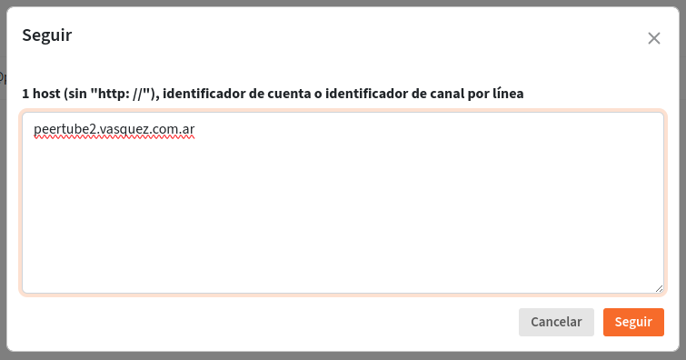

# How To: Peertube

# Requisitos del sistema

### Requisitos mínimos de hardware:

- 1 núcleo virtual
- 1,5 GB de RAM
- Suficiente almacenamiento para videos
- Velocidad de subida de la red de 20 Mbit/s
- Suficiente ancho de banda para transmitir videos

### Requisitos de hardware recomendados para una instancia grande con 1.000 visores simultáneos:

- 4 núcleos virtuales
- 4 GB de RAM
- Suficiente almacenamiento para videos
- Velocidad de subida de la red de 1 Gbit/s
- Suficiente ancho de banda para transmitir videos
- Lea la guía de escalabilidad si planea tener muchos usuarios o espectadores

### Si planea realizar la transcodificación en la misma máquina que la instancia de PeerTube:

- 8 núcleos virtuales
- 8 GB de RAM

# Dependencias

<aside>
💡 ***Atención***: los pasos de instalación son para el sistema operativo Ubuntu y derivados.

</aside>

Versión de dependencias principales necesarias para la instalación de PeerTube:

- `node` ≥ 18.x [*](https://www.notion.so/How-To-Peertube-4dd0564072c7466e9a6a1203ec4d7de2?pvs=21)
- `yarn` 1.x (no debe ser ≥ 2.x)
- `ffmpeg` ≥ 4.3 (usar ffmpeg static build [no es recomendado](https://github.com/Chocobozzz/PeerTube/issues/6308))
- `certbot`
- `nginx`
- `postgresql` y `postgresql-contrib`  ≥10.x

- `redis` y `redis-server` ≥ 6.2.x
- `openssl`
- `g++` ≥ 5.x
- `make`
- `git`
- `cron`
- `wget`

<aside>
💡 ***Nota***: solo se admiten las versiones LTS de las dependencias externas. Si no hay disponible ninguna versión LTS que coincida con la restricción de versión, solo se admiten las versiones de lanzamiento.

</aside>

<aside>
💡 *** Versión Node**

Si bien en el listado de dependencias de Peertube figura “node ≥ 18.x”, una versión superior de node como 20.x presenta incompatibilidades con algunas dependencias, por lo que recomendamos utilizar 18.x.

</aside>

## Instalación

En un nuevo Debian/Ubuntu, como usuario root, instalar los programas de utilidad básicos necesarios para la instalación:

```bash
apt-get install curl sudo unzip vim
```

Sería prudente deshabilitar el acceso root y continuar este tutorial con un usuario con acceso de grupo sudoers.

### NodeJS 18.x:

```bash
curl -fsSL <https://deb.nodesource.com/setup_18.x> | sudo -E bash - &&\\
sudo apt-get install -y nodejs
```

### Yarn:

```bash
npm install --global yarn
```

### Python:

```bash
# la versión debería ser >= 2.x o >= 3.x
sudo apt update
sudo apt install python-dev python3-dev python-is-python3
```

### Resto de las dependencias:

```bash
sudo apt update
sudo apt install certbot nginx ffmpeg postgresql postgresql-contrib openssl g++ make redis-server git cron wget
```

Ahora que las dependencias están instaladas, antes de ejecutar PeerTube debe iniciar PostgreSQL y Redis:

```bash
sudo systemctl start redis postgresql
```

# Producción

## Usuario PeerTube

Crear un usuario de peertube con `/var/www/peertube` como directorio:

```bash
sudo useradd -m -d /var/www/peertube -s /bin/bash -p peertube peertube
```

Establecer su contraseña:

```bash
sudo passwd peertube
```

Asegurarse de que nginx pueda atravesar el directorio raíz de peertube (los permisos deberían ser `drwxr-xr-x`):

```bash
ls -ld /var/www/peertube 
```

<aside>
💡 En caso de que los permisos no sean los necesarios, modificarlos ejecutando: 
`sudo chmod 755 /var/www/peertube`

</aside>

## Base de datos

Crear la base de datos de producción y un usuario peertube dentro de PostgreSQL:

```bash
cd /var/www/peertube
sudo -u postgres createuser -P peertube
```

Ingresar una contraseña para el usuario peertube de PostgreSQL, que debe copiarse en el archivo `production.yaml`.

```bash
sudo -u postgres createdb -O peertube -E UTF8 -T template0 peertube_prod
```

A continuación, habilitar las extensiones que PeerTube necesita:

```bash
sudo -u postgres psql -c "CREATE EXTENSION pg_trgm;" peertube_prod
sudo -u postgres psql -c "CREATE EXTENSION unaccent;" peertube_prod
```

## Directorio de PeerTube

Setear una variable de entorno que contenga la ultima versión de Peertube:

```bash
VERSION=$(curl -s <https://api.github.com/repos/chocobozzz/peertube/releases/latest> | grep tag_name | cut -d '"' -f 4) && echo "Latest Peertube version is $VERSION"
```

Abrir el directorio peertube, cree algunos directorios necesarios:

```bash
cd /var/www/peertube
sudo -u peertube mkdir config storage versions
sudo -u peertube chmod 750 config/
```

Descargar la última versión del cliente de Peertube, descomprirlo y quitar el zip:

```bash
cd /var/www/peertube/versions
sudo -u peertube wget -q "https://github.com/Chocobozzz/PeerTube/releases/download/${VERSION}/peertube-${VERSION}.zip"
sudo -u peertube unzip -q peertube-${VERSION}.zip && sudo -u peertube rm peertube-${VERSION}.zip
```

Instalar PeerTube:

```bash
cd /var/www/peertube
sudo -u peertube ln -s versions/peertube-${VERSION} ./peertube-latest
cd ./peertube-latest && sudo -H -u peertube yarn install --production --pure-lockfile
```

## Configuración de PeerTube

Copie el archivo de configuración predeterminado que contiene la configuración predeterminada proporcionada por PeerTube. No debe actualizar este archivo.

```bash
cd /var/www/peertube
sudo -u peertube cp peertube-latest/config/default.yaml config/default.yaml
```

Ahora copie la configuración de ejemplo de producción:

```bash
cd /var/www/peertube
sudo -u peertube cp peertube-latest/config/production.yaml.example config/production.yaml
```

A continuación, editar el archivo `config/production.yaml` de acuerdo con la configuración del servidor web y de la base de datos. 

Las claves definidas en `config/production.yaml` invalidarán las claves definidas en `config/default.yaml`. 

En particular, los parámetros principales a configurar son:

- `webserver`: Información pública de proxy inverso
    - Ejemplo: `peertube.vasquez.com.ar`
- `secrets`: Cadenas secretas que debe generar manualmente
    - Se puede usar el comando `openssl rand -hex 32`
    - Ejemplo: `0aac5e522271b10dbe34270d966143e49c84ec03613cdcc5b4dfe5046389cb60`
- `database`: Configuración de PostgreSQL
- `redis`: Configuración de Redis
- `smtp`: Si se quiere usar correos electrónicos
- `admin.email`: Para rellenar correctamente el correo electrónico del usuario `root`.

<aside>
🚫 *PeerTube no admite el cambio de host del servidor web.*

</aside>

Para editar el archivo de configuración usar el comando:

```bash
sudo vim /var/www/peertube/config/production.yaml
```

### Webserver

```bash
sudo cp /var/www/peertube/peertube-latest/support/nginx/peertube /etc/nginx/sites-available/peertube
```

Establecer el dominio para el archivo de configuración del servidor web reemplazando `[peertube-domain]` con el dominio para el servidor PeerTube:

```bash
sudo sed -i 's/${WEBSERVER_HOST}/**[peertube-domain]**/g' /etc/nginx/sites-available/peertube
sudo sed -i 's/${PEERTUBE_HOST}/127.0.0.1:9000/g' /etc/nginx/sites-available/peertube
```

- Recordar cambiar **[peertube-domain]** por su propio dominio donde se vaya a hostear Peertube.
    - Ejemplo: `peertube.vasquez.com.ar`

A continuación, modificar el archivo de configuración del servidor web. Por favor, prestar atención a:

- Las rutas de las directivas `alias`, `root` y `rewrite`, las rutas deben corresponder a la ubicación de su sistema de archivos PeerTube
- Las directivas `proxy_limit_rate` y `limit_rate` si planea transmitir videos de alta tasa de bits.

```
sudo vim /etc/nginx/sites-available/peertube
```

Activar el archivo de configuración:

```bash
sudo ln -s /etc/nginx/sites-available/peertube /etc/nginx/sites-enabled/peertube
```

Para generar el certificado para su dominio según sea necesario para que https funcione, puede usar Let's Encrypt:

```bash
sudo systemctl stop nginx
sudo certbot certonly --standalone --post-hook "systemctl restart nginx"
sudo systemctl reload nginx
```

Certbot debería haber instalado un cron para renovar automáticamente su certificado. Dado que nuestra plantilla nginx admite la renovación de webroot, se sugiere actualizar el archivo de configuración de renovación para usar el autenticador webroot:

- Reemplazar `authenticator = standalone` por `authenticator = webroot`
- Añadir `webroot_path = /var/www/certbot`

```bash
sudo vim /etc/letsencrypt/renewal/your-domain.com.conf
```

### Systemd

Si su sistema operativo usa systemd, copie la plantilla de configuración:

```bash
sudo cp /var/www/peertube/peertube-latest/support/systemd/peertube.service /etc/systemd/system/
```

Comprobar el archivo de servicio (rutas de PeerTube y directivas de seguridad):

```
sudo vim /etc/systemd/system/peertube.service
```

Recargar la configuración de systemd:

```bash
sudo systemctl daemon-reload
```

Si se quiere iniciar PeerTube en el arranque:

```bash
sudo systemctl enable peertube
```

Correr:

```bash
sudo systemctl start peertube
sudo journalctl -feu peertube # Visualizacion de logs
```

<aside>
💡 Ahora que su instancia está en funcionamiento, puede agregarla al índice público de instancias de PeerTube si lo desea: [https://instances.joinpeertube.org/](https://instances.joinpeertube.org/)

</aside>

# **Administrador**

El nombre de usuario del administrador es `root` y la contraseña se genera automáticamente. Puede encontrarse en los registros de PeerTube (la ruta está definida en `production.yaml`). También puede establecer otra contraseña con:

```bash
cd /var/www/peertube/peertube-latest && NODE_CONFIG_DIR=/var/www/peertube/config \
NODE_ENV=production npm run reset-password -- -u root
```

Alternativamente, uno puede visualizar la contraseña autogenerada por Peertube leyendo un archivo de logs de la siguiente manera:

```bash
cd /var/www/peertube/
sudo cat storage/logs/peertube.log | grep password
```

# Configuración de Sincronización

Para sincronizar una instancia, esta debe seguir a la instancia con la que quiere realizar la sincronización.

Debemos ir a **Administration** → **Federation** → **Following** → **Follow**, luego introducir la url de la instancia que queremos seguir:



# Referencias

[Dependencies | PeerTube documentation](https://docs.joinpeertube.org/support/doc/dependencies#debian-ubuntu-and-derivatives)

[Production guide | PeerTube documentation](https://docs.joinpeertube.org/install/any-os)